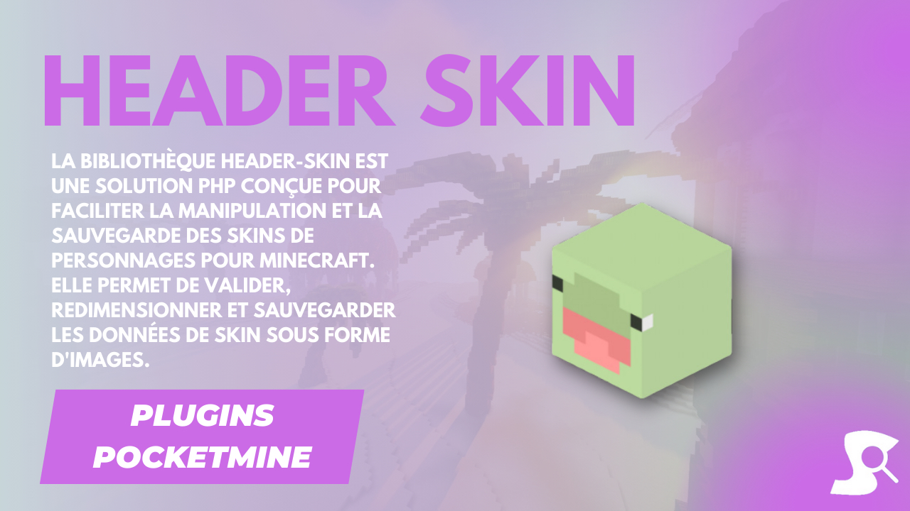

# [Header-Skin](https://github.com/Synopsie/Header-Skin) Plugin 👥


## Features 🛠️

- **Command**: Use `/givehead` to give player heads.
- **Configurable**: Various customization options.
- **Permissions**: Control command access.
- **Messages**: Inform players of actions.

## Configuration 📝

```yaml
# Header-Skin Config

command:
  name: givehead
  description: Permet de vous donner la tête d'un joueur
  usage: /givehead <player> [target] [count]
  alias:
    - giveh
  permission:
    name: givehead.use
    default: operator # console -> seulement console | operator -> seulement les op | user -> tous le monde

head.name: Tête de §e%player%

# Permet de donner à la à la mort du joueur
drop.head: true
blacklist: # Permet d'empêcher le fait qu'une tête tombe à la mort d'un joueur si le drop.head est activé.
  - Steve

enable.collision: false
motion.force: 0.1

use.command.in.game: Utilisez cette commande en jeu
player.skin.not.found: §cLe skin du joueur n'a pas été trouvé, vérifiez qu'il a bien été enregistré.
inventory.full: §cVotre inventaire est plein.
```

## License 📜

Licensed under MIT. See [LICENSE](LICENSE) for details.

---

